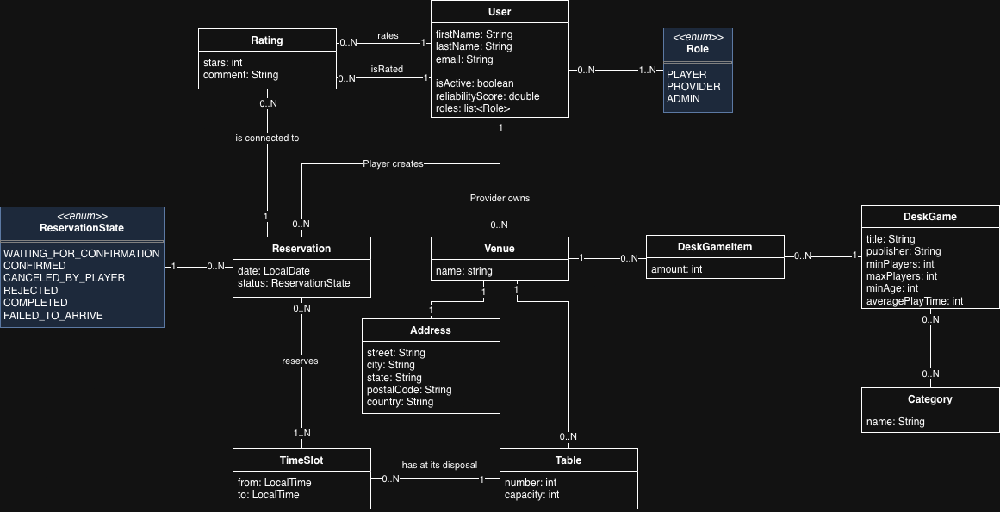

# 📘 Software Requirements Specification (SRS)
## Projekt: Aplikace pro nabízení a rezervaci míst určených k hraní deskových her  

---

## 1. ÚVOD
### 1.1 Účel dokumentu
Dokument specifikuje základní požadavky na vývoj softwarového systému pro nabízení a rezervaci prostor určených k hraní deskových her a slouží jako podklad pro návrh, implementaci a testování systému. 

### 1.2 Použité zkratky

| Zkratka | Význam |
|----------|---------|
| API | Komunikační rozhraní (Application Proggraming Interface) |
| DB | Databáze |
| FR | Funkční požadavek (Functional requirement) |

### 1.3 Cílové publikum a doporučený způsob čtení
Dokument je určen primárně vývojářům, testerům a stakeholderům projektu.

### 1.4 Rozsah projektu
Systém je webová aplikace typu **two-sided marketplace**, která propojuje:
- **Poskytovatele** – kavárny, restaurace nebo herní centra nabízející prostory pro hraní her 
- **Hráče** – uživatele, kteří tato místa vyhledávají, rezervují a hodnotí.  

Aplikace umožní spravovat nabídky, provádět rezervace, sledovat reputaci hráčů i poskytovatelů a usnadní organizaci herních sezení.

---

## 2. CELKOVÝ POPIS SYSTÉMU
### 2.1 Perspektiva systému
- Systém je koncipován jako webová aplikace s architekturou **client/server**.  
- Frontend běží v prohlížeči, backend zajišťuje správu databáze a API pro komunikaci s klientem.  
- Databáze ukládá informace o uživatelích, nabídkách, rezervacích a hodnoceních.

### 2.2 Funkce systému
| ID | Název funkce | Popis | Priorita |
|----|--------------|-------|----------|
| FR-1 | Registrace uživatele | Uživatel se může registrovat jako hráč nebo poskytovatel. | Vysoká |
| FR-2 | Přihlášení | Ověření identity uživatele pomocí e-mailu a hesla. | Vysoká |
| FR-3 | Nabídka herních slotů | Poskytovatel může vytvářet a spravovat nabídky volných časových slotů v místě, jež na platformě nabízí. | Vysoká |
| FR-4 | Vyhledávání a rezervace | Hráč může vyhledávat dostupné nabídky a rezervat si termíny. | Střední |
| FR-5 | Potvrzení rezervace | Poskytvoatel musí ručně potvrdit nebo odmítnout rezervaci. | Vysoká |
| FR-6 | Zrušení rezervace | Hráč může rezervaci zrušit do stanoveného limitu. | Vysoká |
| FR-7 | Hodnocení | Po uskutečnění rezervace se mohou obě strany navzájem hodnotit. | Střední |
| FR-8 | Systém reputace | Výpočet průměrného hodnocení a rankingu hráčů. | Nízká |
| FR-9 | Detecke spolehlivosti | Systém kontroluje spolehlivost uživatelů, zda-li se dostaví na rezervaci či ne - pro účely FR-8 | Nízká |
| FR-10 | Správa profilu | Uživatelé mohou upravovat své základní údaje - jméno, adresa, ... | Nízká |

### 2.3 Typy uživatelů
| Role | Popis | User akce |
|------|--------|----------------|
| **Hráč** | Registrovaný uživatel, který hledá místo pro hraní her. | Vyhledávání, rezervace, hodnocení poskytovatelů. |
| **Poskytovatel** | Provozovatel prostoru, který nabízí herní místo. | Výroba nabídek, potvrzení rezervací, hodnocení hráčů. |
| **Administrátor** | Správce systému a dat. | Správa uživatelů, mazání nevhodného obsahu. |

### 2.4 Provozní prostředí
- Webová aplikace běžící na platformě **Java / Spring Boot**
- Databáze: **PostgreSQL**
- Klientská část: webové rozhraní (HTML/CSS/JS)
- Build: **Maven**

### 2.5 Omezení návrhu a implementace
- Systém určen pouze pro rezervaci prostor
- Platby probíhají mimo systém (externí platební brána, v místě nabízeného herního místa, ..)
- Rezervace vyžadují ruční potvrzení poskytovatelem (nejsou okamžité v reálném čase)
- Systém neřeší správu inventáře her (hry jsou uvedeny pouze textovým popisem v nabídce)
- Aplikace vyžaduje aktivní připojení k internetu

### 2.6 Předpoklady a závislosti
- Databázový server je dostupný a správně nakonfigurovaný
- Autentizace bude založena na uživ. jméně a hesle (uložen jako hash)
- Aplikace je přístupná ze všech moderních prohlížečů

---

## 3. OBJEKTOVÝ MODEL (UML CLASS DIAGRAM)
### 3.1 Popis modelu
Uživatel může pojmout 1..N rolí - `PLAYER` (Hráč), `PROVIDER` (Poskytovatel), `ADMIN`

Poskytovatel vytváří `Venue` (realná místa/pobočky kde lze hrát), `DeskGame` (samotné deskové hry) a `TimeSlot` (časové nabídky kdy lze v rámci dne hrát).

Hráč na tyto nabídky vytváří `Reservation`. Každá Rezervace má své datum a `ReservationState` (čekající, potvrzeno, zrušeno, atd..) a po jejím dokončení (nebo selhání) = následující den, k ní může být přiřazen `Rating` od obou stran. Z `Rating` se následně vyhodnocuje reliabiltyScore (spolehlivost) uživatelů.

### 3.2 Návrh tříd
| Třída | Popis |
|--------|--------|
| `User` | Základní třída uživatele, krom obyčejných parametrů, uchovává také `Role` a reliabiltyScore. |
| `Role` | Upřesňuje schopnosti uživatele, základní role jsou PLAYER (rezervuje si `TimeSlot`), PROVIDER (nabízí `Venue` kde si lze zarezervovat místo) a ADMIN. |
| `Rating` | Reprezentuje zpětnou vazbu. Je vždy vázáno na konkrétní `Reservation`. Obsahuje autora (kdo hodnotil), cíl (kdo byl hodnocen), skóre (1-5 hvězdiček) a textový komentář. |
| `Venue` | Jedná se o pobočku/reálné místo kde se `Reservation` uskutečnují, `Provider` jich může mít několik. |
|`Address`| Fyzická adresa `Venue` |
| `DeskGameItem` | Jednotková položka `DeskGame`, uchovává aktuální počet dané deskové hry na provozovně (`Venue`) |
| `DeskGame` | Reprezentuje samotnou deskovou hru a její charakteristiky - název, počet hráčů, min. věk, ... |
| `Category` | Categorie deskové hry. _(Pro splnění M:N je možné aby hra měla 0..N kategorií a naopak.)_ |
| `Table` | Přesné místo/stůl/místnost uvnitř `Venue` kde se může hrát, obsahuje počet míst a unkátní označení. |
| `TimeSlot` | Reprezentuje nabízený časový slot. |
| `Reservation` | Samotná rezervace jenž obsahuje zarezervovné časové sloty a datum rezervace. |
| `ReservationState` | Klíčová entita určijící stav `Reservation`, slouží také pro `Rating`, kdy FAILED_TO_ARRIVE automaticky nastaví hodnocení 0/5 vzhledem k `User` s rolí `PLAYER` |

---

## 4. PŘÍLOHY
- [UML.drawio source](./resources/UML.drawio)

